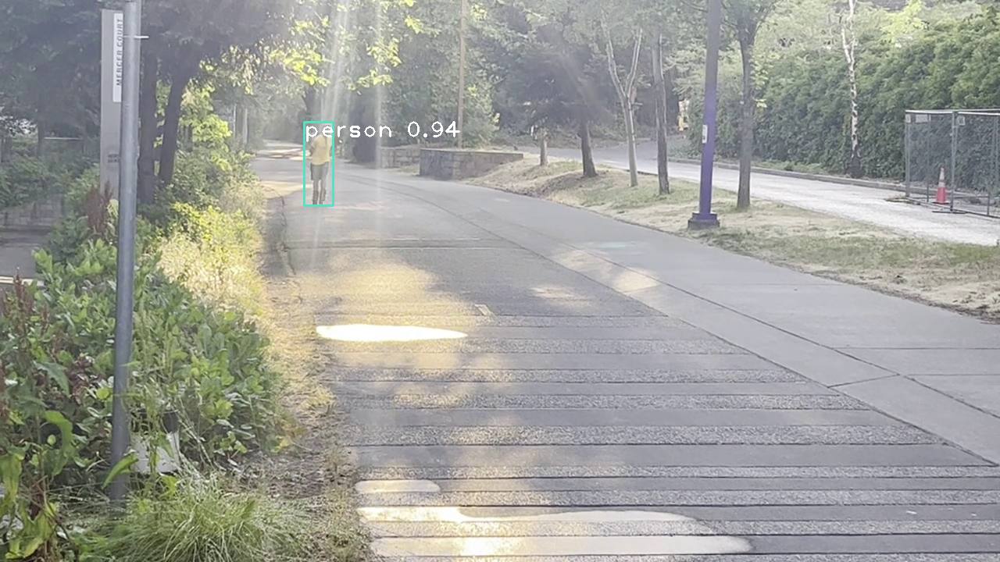
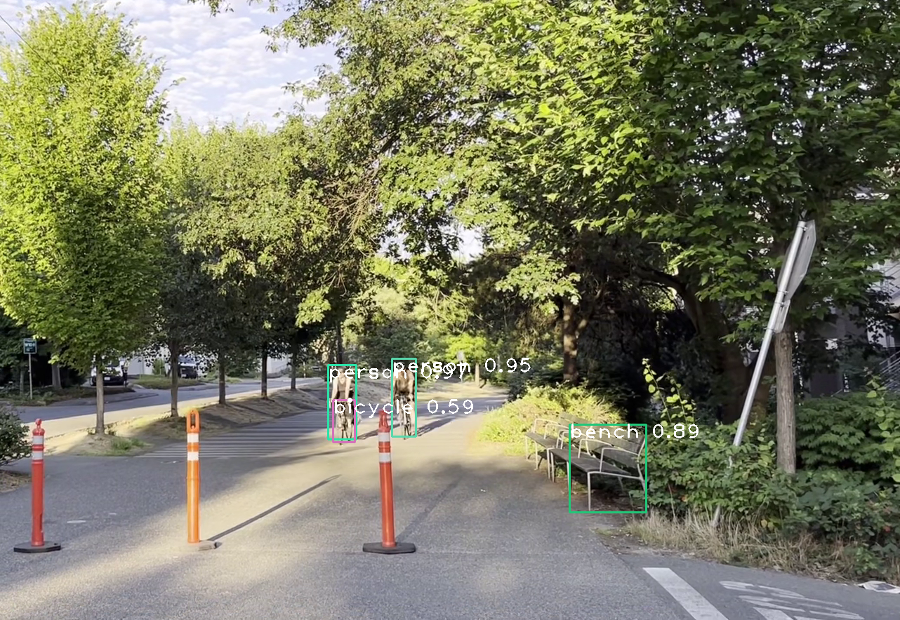

# Accessible Pathways: An AI-Driven Approach to Urban Accessibility

## Object Detection
Our application leverages cutting-edge computer vision technology to detect and predict accessibility features such as wheelchair ramps and accessible pathways from street view videos. The objective is to integrate these detections into our Simultaneous Localization and Mapping (SLAM) model, thereby creating a dynamic and comprehensive map of the environment. This map can be used for efficient navigation and accessibility planning.

Here's a brief overview of our process:
* **Camera Calibration**. This process helps us understand the camera's intrinsic and extrinsic parameters, which are crucial for mapping the image coordinates to real-world coordinates.
* **Object Detection with YOLOv4**. The model identifies accessibility features and creates an overlay image with bounding boxes of the detected objects for each video frames. These bounding boxes are then overlaid back onto the subsequent frames of our video stream, providing real-time object detection.
* **Conversion to Geospatial Data**. This involves mapping the image coordinates of the detected objects to real-world coordinates, taking into account the camera's field of view, orientation, and location.
* **Updating the SLAM Map**. The geospatial data derived from the object detection is used to update our SLAM map.

Below are screenshots demonstrating how the object detection works:

---
**Statement**
This application is developed for non-profit purposes and is intended to improve urban accessibility for all. The video footage used in our model is exclusively shot in public area. Our goal is to create a more inclusive and accessible environment, and we are committed to doing so in a manner that respects individual privacy and public space.
